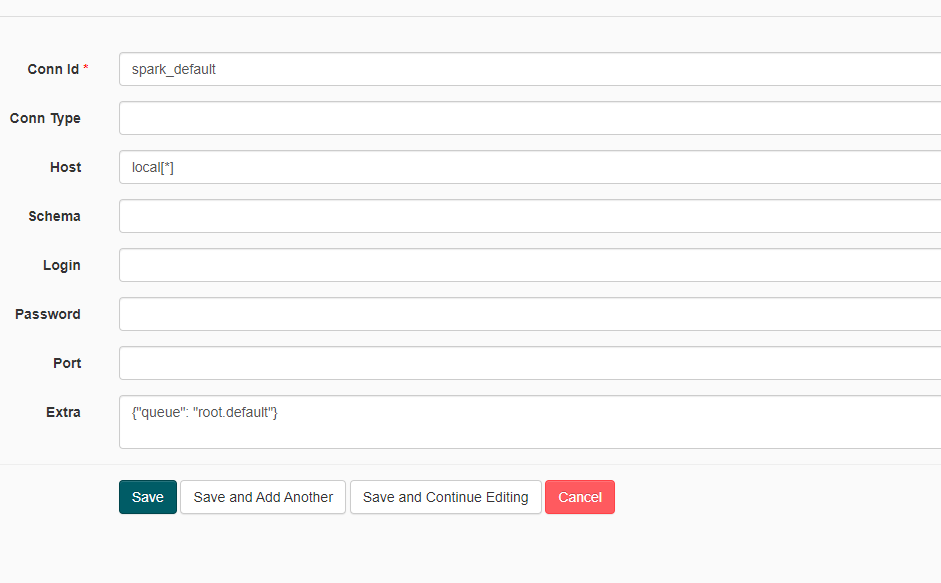
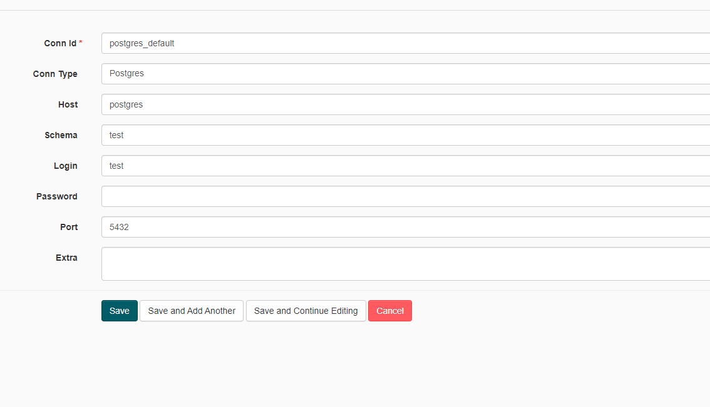
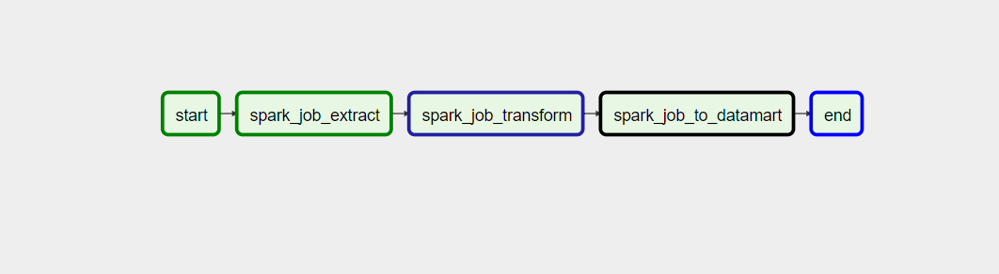

## Setup
### Clone project

    $ git clone https://github.com/shahinyusifli/transaction-management

### Start containers from docker folder

Navigate to docker folder and:

    $ docker-compose up

If you want to run in background:

    $ docker-compose up -d

## Running the DAG
Airflow: http://localhost:8282

Then change the two default connection properties:

 - spark-default
 - postgres-default 

Follow the settings in the following instructions:

1. Check the spark application in the Spark Master web UI (http://localhost:8181) and change the
    spark conn property to the follwoing:
   

1. For postgres change the postgres conn property to the follwoing:
   

There is only one dag inside the dag folder. You just have to trigger the dag to run. 

      

